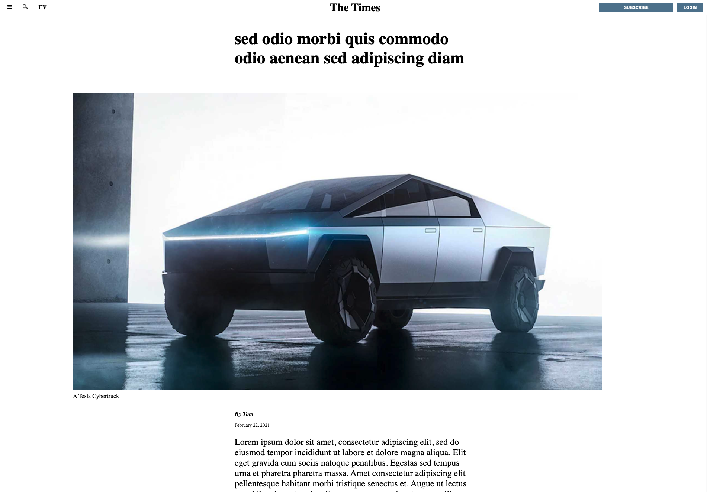

# Positioning-And-Floating-Elements

Recreated an article view similar to the [New York Times](https://www.nytimes.com/2014/03/18/science/space/detection-of-waves-in-space-buttresses-landmark-theory-of-big-bang.html?_r=0).

    

## Features

- Uses CSS Grid.

## Demo

- https://cameronstamant.github.io/Positioning-And-Floating-Elements/
